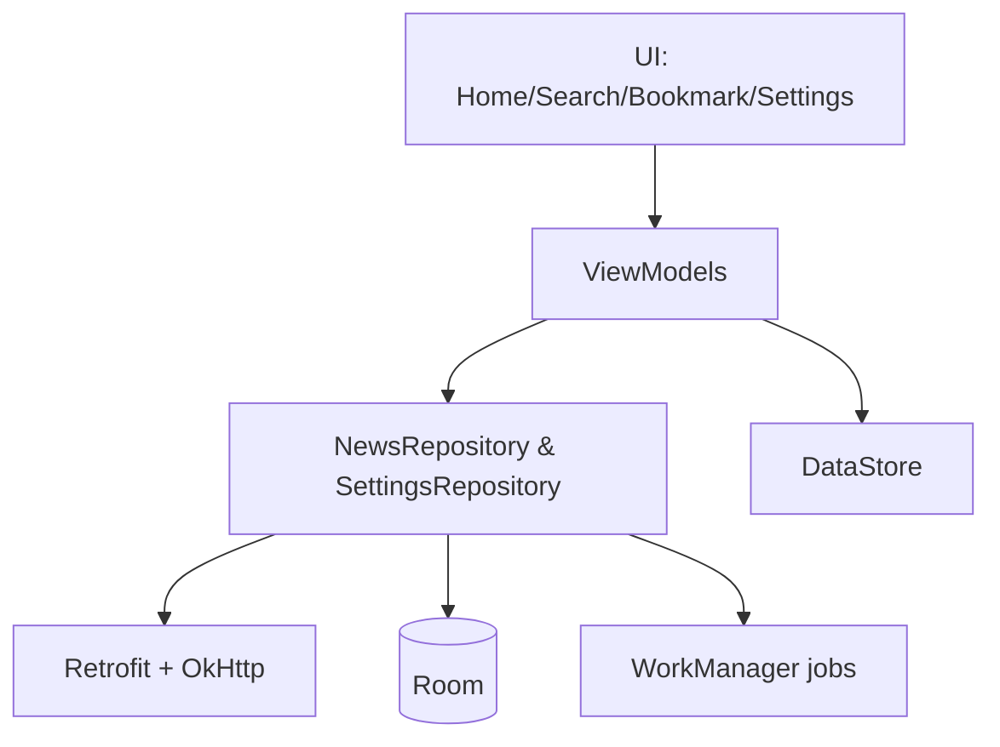

# DailyScope

Modern Android news reader built with Kotlin, MVVM, Room, Retrofit, Paging 3, StateFlow, and Dagger. Browse the latest headlines, search globally, filter by category/date/sentiment, and manage bookmarks with offline support and background refresh.

## Features
- Home feed backed by Room with pull-to-refresh and offline cache
- Material Search screen with suggestions, paging results, and bookmark toggles
- Filters for date, category, and sentiment via bottom-sheet UI
- Bookmarks list and detail reader with optional auto-speak hook
- Notifications: fetched-news and breaking-news alerts; auto cleanup of old articles
- Theming: Dark mode and optional Material You dynamic colors

## Tech stack
- Kotlin, Coroutines, StateFlow
- MVVM + Navigation Component
- Room (offline cache) with Paging 3
- Retrofit/OkHttp + Gson
- Dagger 2 for dependency injection
- DataStore Preferences for settings
- WorkManager for background sync, breaking news, and cleanup
- Glide + Material Components for UI/imagery

## Quick start
```powershell
git clone https://github.com/shubham-8609/DailyScope-News-App-.git
cd DailyScope
.\gradlew.bat assembleDebug
```
Open in Android Studio and run on a device/emulator. Replace the WorldNews API key in `DI/NewsRepositoryModule.kt` before shipping (see `docs/setup.md`).

## Architecture at a glance


## Documentation
- `docs/architecture.md` – overall layering and DI graph
- `docs/data-layer.md` – models, Room, Retrofit, repositories, paging
- `docs/ui-layer.md` – screens, ViewModels, adapters, navigation
- `docs/search-feature.md` – search UX and data flow
- `docs/filters.md` – filtering pipeline
- `docs/setup.md` – prerequisites, API key, build/run steps

## Usage notes
- Background jobs are toggled from Settings (auto refresh, breaking news, auto cleanup).
- Bookmarks persist across refreshes; search results merge bookmark state from Room.
- If you migrate Room schema during development, uninstall the app or rely on destructive migrations.

## Screenshots
_Add screenshots or recordings here when available._

