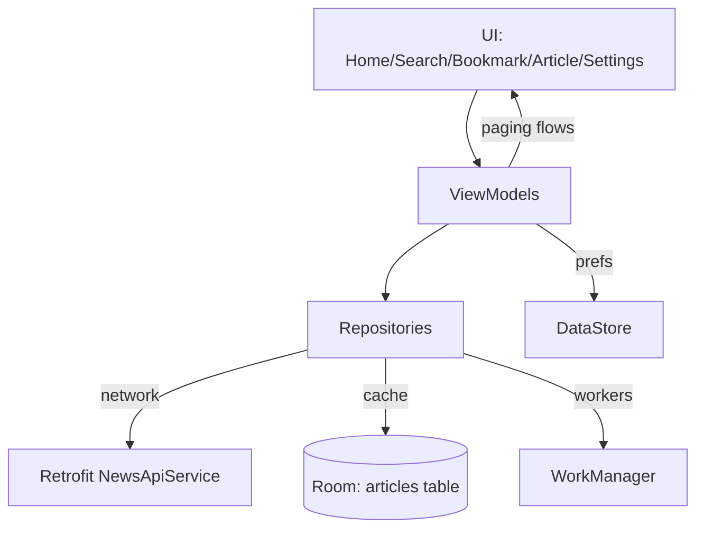

# Architecture

DailyScope follows a layered MVVM architecture with unidirectional data flow and dependency injection via Dagger.

## Layered overview
- **UI layer (Activity/Fragments + adapters)** renders state and routes user actions to ViewModels.
- **Domain/data layer (ViewModels + Repositories)** holds UI-facing state, coordinates paging, and orchestrates business rules.
- **Data sources (Room, Retrofit, DataStore)** persist articles, fetch remote data, and store preferences.
- **Background work (WorkManager)** performs periodic sync, breaking-news alerts, and cleanup without blocking the UI.

## Dependency injection
- **`DI/AppComponent`** wires the graph with `@Singleton` scope.
- **Modules**: `NewsRepositoryModule` provides Retrofit (`NewsApiService` with API-key interceptor) and DataStore; `NewsDaoModule` provides Room `NewsDB` and `NewsDao`.
- **Entry point**: `DailyScope` builds `DaggerAppComponent`, exposes `newsRepository` and `settingsRepository`, and starts `BackgroundSyncManager`.

## Data flow
1. UI triggers actions (refresh, search, filters, bookmarks).
2. ViewModels (e.g., `MainViewModel`, `SearchViewModel`) expose StateFlow/Flow<PagingData<Article>> and call repositories.
3. `NewsRepository` decides whether to read paged data from Room (`NewsDao.getPagedArticles`, `getFilteredNews`) or fetch via Retrofit (`NewsApiService.getLatestNews`, `searchNews`).
4. Network responses are mapped to entities (`Mapper.kt`) and saved to Room; bookmarked URLs are preserved across refreshes.
5. Paging 3 streams data back to the UI adapters.
6. Preferences (`SettingsRepository`) are read as flows for theme, notifications, search behavior, and background jobs.

## Background work
- `BackgroundSyncManager` reacts to preference flows and schedules WorkManager jobs:
  - `NewsSyncWorker` – periodic fetch with fetched-news notifications.
  - `BreakingNewsWorker` – alternates good/bad sentiment alerts.
  - `CleanupOldArticlesWorker` – trims articles older than a few days.

## Navigation & state
- Single-activity (`MainActivity`) with Navigation Component hosts bottom navigation destinations: Home, Search, Bookmark, Settings, Article.
- Toolbar titles/subtitles update per destination; bottom nav hides on detail pages.
- State survives configuration changes through ViewModels and Room/DataStore backed sources.

